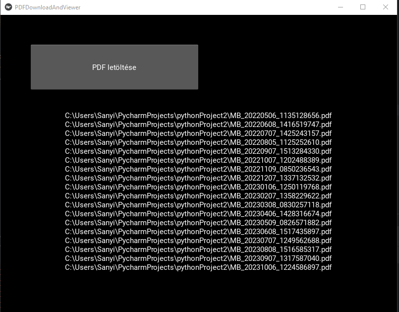

# PDF Download and Viewer App

A Python-based mobile application that allows you to download PDF attachments from your email and view them as PNG images. Built using the Kivy framework, this app provides a simple way to access and view PDF documents on your mobile device.

## Features

- Download PDF attachments from your email using IMAP.
- View downloaded PDFs as PNG images.
- Zoom in and out of the PDF images for better readability.

## Prerequisites

Before you get started, make sure you have the following dependencies installed:

- Python: Ensure you have Python 3.x installed on your system.
- Kivy: This app is built using the Kivy framework.

- ## How It Works

- Click the "PDF letöltése" (Download PDF) button to download PDF attachments from your email. You will be prompted to enter your email credentials.

- Once downloaded, the PDFs will be listed in the app.

- Click on a PDF to view it as a PNG image. You can zoom in and out for better readability.

## Screenshots

_Main Screen_

## License

This project is licensed under the MIT License - see the [LICENSE](LICENSE) file for details.

## Acknowledgments

- This app uses the [Kivy](https://kivy.org/) framework for the graphical user interface.
- PDF to image conversion is done using the [PyMuPDF (fitz)](https://pymupdf.readthedocs.io/) library.

## Author

- redrickh
- GitHub: https://github.com/redrickh

Feel free to customize this README to match your project's specifics. Provide additional information, installation instructions, or any other details that users may find helpful.
